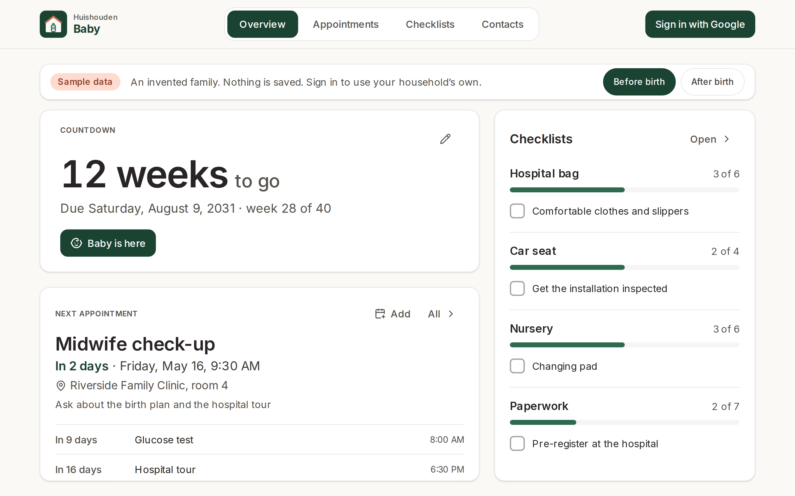
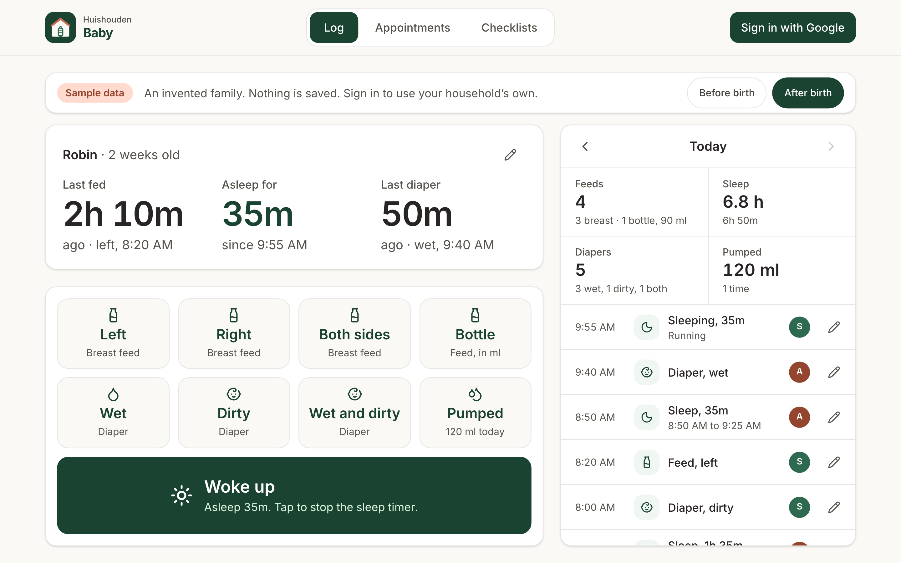
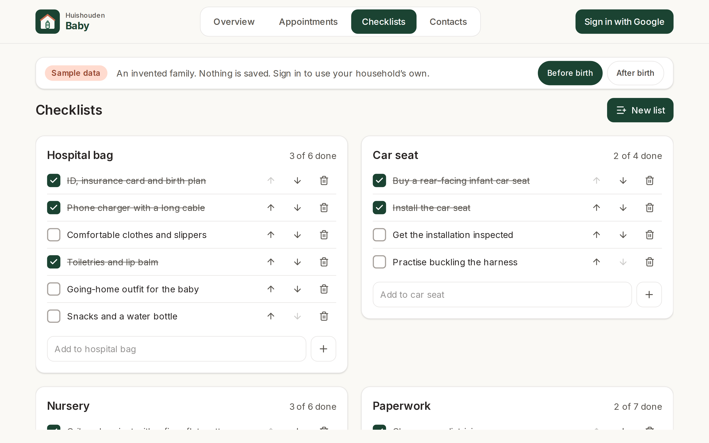
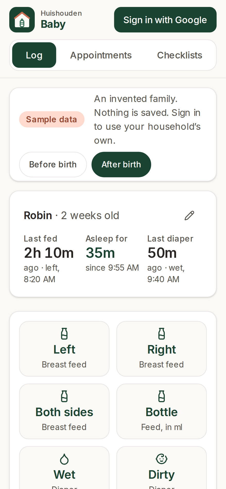
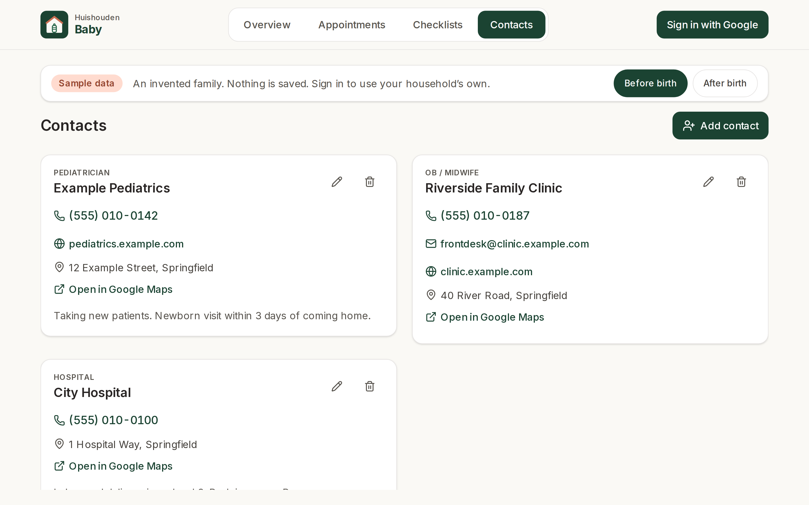
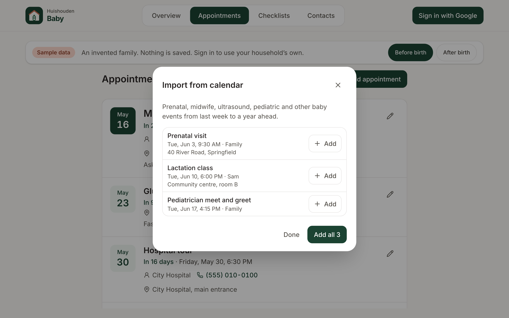

# Huishouden Baby

A wall-tablet app for a household expecting a baby. Before the birth it shows the due-date countdown,
upcoming appointments, checklists (hospital bag, car seat, nursery, paperwork) and the care team's
contacts (pediatrician, midwife, hospital), each one tap from a call or a map. After the birth the
main screen becomes a one-tap log of feeds, sleep, diapers and pumping, readable from across the room:
when the baby last ate, how long they have been asleep or awake, and today's totals. Every entry shows
who logged it, and the whole household sees the same log.

Live at https://huishouden-baby.web.app, also linked from the [Huishouden portal](https://huishouden-piekstra.web.app).
Installable on the tablet, phones and laptops, and works offline (entries sync when the connection is back).

## Screenshots

| Before the birth | After: the log |
|---|---|
|  |  |

| Checklists | Phone |
|---|---|
|  |  |

| Contacts | Import from calendar |
|---|---|
|  |  |

_Screenshots of the live site signed out, which shows an invented sample family dated in 2031 (`?demo=after` for the log). Refreshed by CI after each deploy._

## Data

Signed-in members of a Huishouden household read and write under `households/{householdId}`:
`babyProfile/main` (name, due date, birth date), `babyEvents` (feed, sleep, diaper, pump),
`babyChecklists` and `babyAppointments` (an appointment may point at a contact and at the calendar
event it came from). Contacts live in the household-wide `contacts` collection shared by every app
(`@huishouden/pwa-kit/contacts`); Baby shows those whose `apps` include `baby`. The Firestore rules
live in the repo that owns the project's rules file. Signing in uses Google with no extra scopes; the
household comes from the shared `households` document, so one invite from the portal opens every
Huishouden app.

Baby publishes its dates to the household agenda (`households/{householdId}/agenda`,
`@huishouden/pwa-kit/agenda`) so the portal's calendar and Today view show them: each appointment
(timed, with its place and the baby's name) and, until the birth, the due date (all day). Saving or
deleting an appointment or the baby's details updates the agenda at once; opening the app reconciles
it (`src/lib/agenda.ts`). Checklist items have no dates and are not published. Links open the
Appointments tab (`#appointments`) or the main screen.

Find in my calendar and Import from calendar read Google Calendar (read-only) through
`@huishouden/pwa-kit/calendar`; Google asks once for permission the first time. Find a business looks
places up on OpenStreetMap (`@huishouden/pwa-kit/places`), only when Search is pressed.

## Privacy

Household data lives in the household's own Firestore documents, visible only to its members.
To catch problems early, the app sends reports to New Relic (free tier) through
`@huishouden/pwa-kit/observability`: errors (emails, ids, query strings and long numbers removed),
Core Web Vitals and page loads, the app version, device type, and the country and region New Relic
derives from the request; and anonymous usage counts per visit: `log entry` (with its kind: feed, sleep, diaper…), `save appointment`, `add checklist item`, `save baby profile`, and which tab is open. Households are counted by a
hash of the id. No names, emails, entries, free text or precise location, and no cookie or stored
id: nothing links one visit to the next. When the browser sends Global Privacy Control or Do Not
Track, usage counts are skipped; errors and speed still go. Builds without the `VITE_NEWRELIC_*`
repo variables (local, staging) send nothing. The page people see is
[huishouden-piekstra.web.app/privacy](https://huishouden-piekstra.web.app/privacy); details in pwa-kit
[docs/observability.md](https://github.com/huishouden/pwa-kit/blob/main/docs/observability.md).

## Develop

```sh
bun install          # also enables the pre-commit leak scan
bun run env:pull     # writes .env.local from the repo's VITE_* variables
bun run dev          # http://localhost:3002
bun run lint && bun run test && bunx pwa-design-check && bun run build
bun run e2e          # Playwright smoke and sample-data feature tests against the live site (BASE_URL to override)
bun run screenshots  # README screenshots (SCREENSHOT_DIR to override)
bun run icons        # regenerate the logo and PNG icons
```

Built on [huishouden-pwa-kit](https://github.com/huishouden/pwa-kit) and follows its
[design language](https://github.com/huishouden/pwa-kit/blob/main/DESIGN.md) and
[standard](https://github.com/huishouden/pwa-kit/blob/main/STANDARD.md). Pushes to `main` deploy to
Firebase Hosting (project `huishouden-piekstra`, site `huishouden-baby`), then run the smoke tests and refresh the screenshots.
